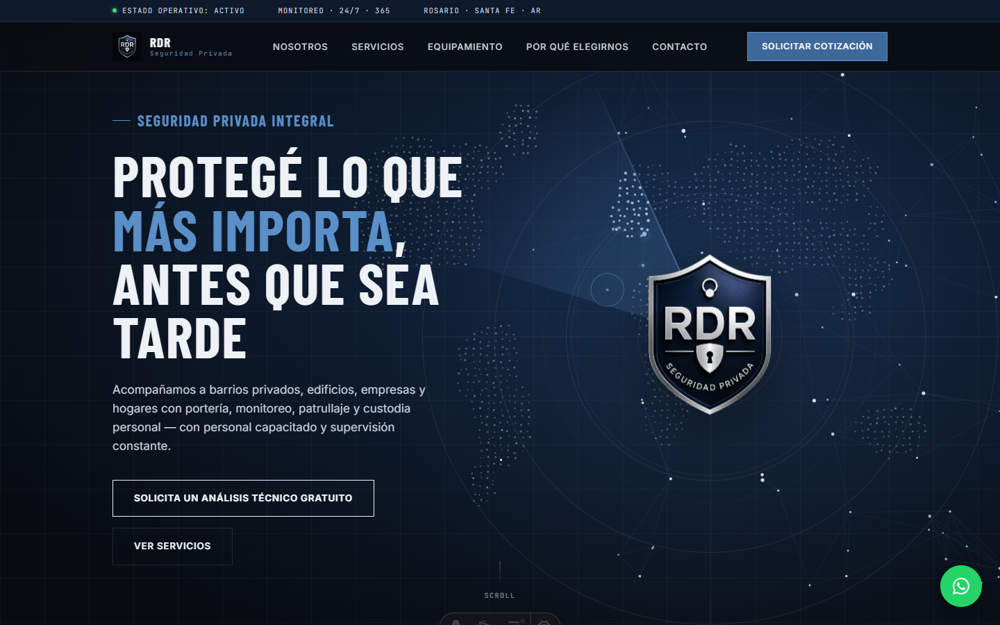
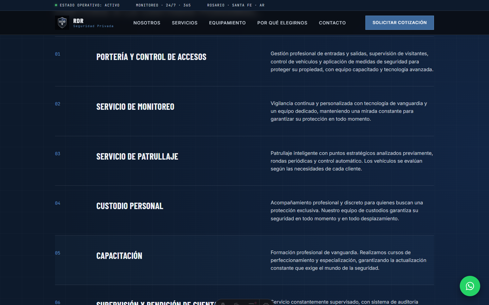
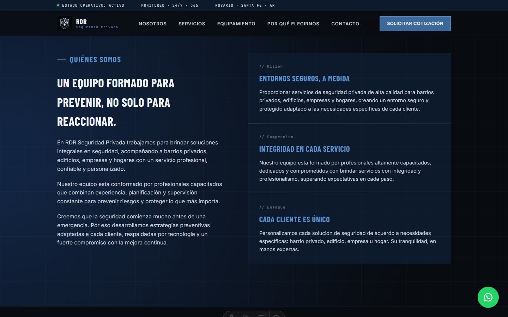
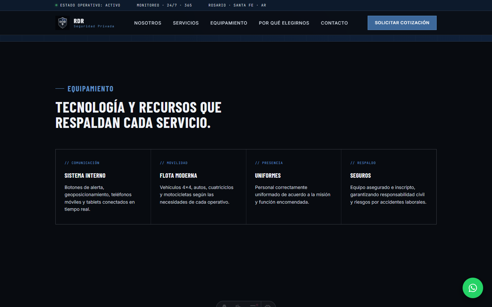
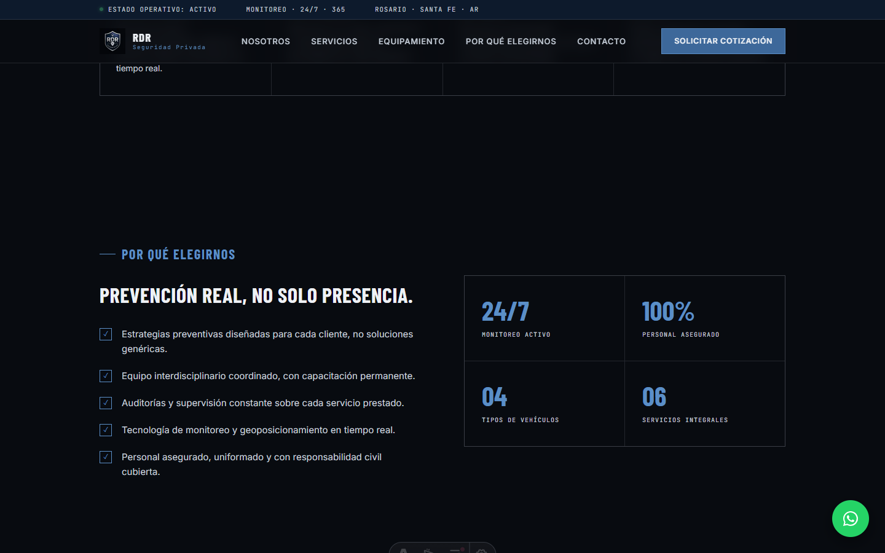
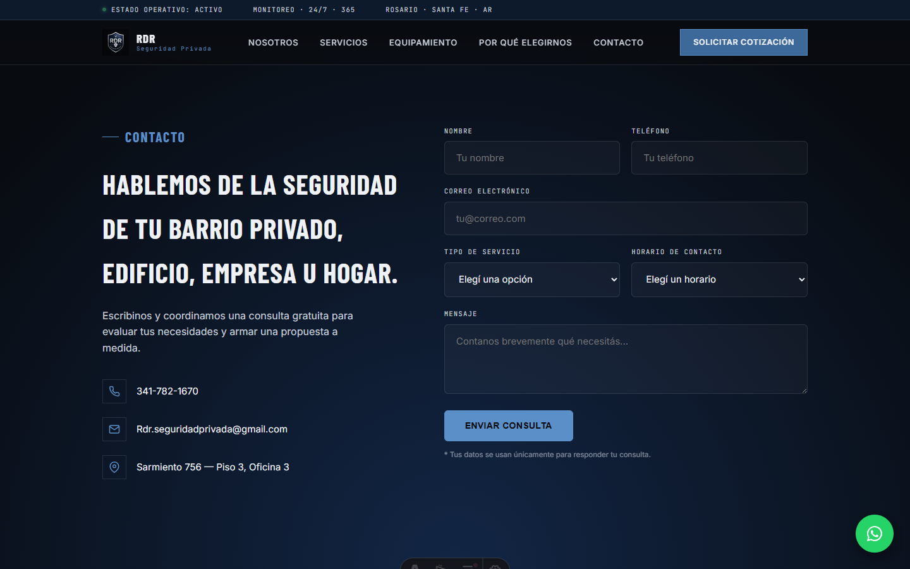

# RDR Seguridad Privada — Landing

Landing page de **RDR Seguridad Privada** (Rosario, Santa Fe, Argentina): empresa de seguridad privada para barrios privados, edificios, empresas y hogares. Construida con Astro + islas de React, scroll suave con Lenis y animaciones de entrada con GSAP/ScrollTrigger. Incluye formulario de contacto con validación, guardado de consultas en MongoDB Atlas y notificación por correo vía Resend.



## Qué ofrece la página

Es una landing de una sola página con navegación por anclas. Secciones:

| Sección | Contenido |
| :-- | :-- |
| **Hero** | Mensaje principal, escudo animado de la marca y llamadas a la acción ("Solicita un análisis técnico gratuito" / "Ver servicios"). |
| **Nosotros** | Presentación del equipo, misión, compromiso y enfoque de trabajo. |
| **Valores** | Los principios detrás de cada guardia, ronda e informe. |
| **Servicios** | Los 6 servicios: portería y control de accesos, monitoreo, patrullaje, custodio personal, capacitación, y supervisión con rendición de cuentas. |
| **Equipamiento** | Sistema interno de comunicación, flota de vehículos, uniformes y seguros. |
| **Por qué elegirnos** | Diferenciales + estadísticas (monitoreo 24/7, personal 100 % asegurado). |
| **Contacto** | Formulario de consulta con validación, más teléfono, correo y dirección de la oficina. |

Además tiene un **botón flotante de WhatsApp**, un **banner promocional** que ofrece el análisis técnico gratuito y una **barra de estado operativo** fija arriba del header.

### Servicios



### Nosotros



### Equipamiento



### Por qué elegirnos



### Contacto

El formulario valida los datos con Zod, guarda cada consulta en MongoDB Atlas y envía una notificación por correo con Resend.



## Tecnologías

- **[Astro](https://astro.build)** — estructura del sitio. La landing se prerenderiza y se sirve estática desde CDN; solo `/api/contact` corre como función serverless.
- **[React 19](https://react.dev)** (`client:load`) — isla interactiva del formulario de contacto.
- **[Lenis](https://lenis.darkroom.engineering/) + [GSAP/ScrollTrigger](https://gsap.com)** — scroll suave y animaciones de entrada por sección.
- **[Zod](https://zod.dev)** — validación del formulario (cliente y servidor).
- **[MongoDB Atlas](https://www.mongodb.com/cloud/atlas)** (tier M0 gratuito) — guarda cada consulta recibida. No se pausa por inactividad.
- **[Resend](https://resend.com)** — envía el correo de notificación por cada consulta.
- **[Vercel](https://vercel.com)** — hosting y funciones serverless para `/api/contact`.

Requiere **Node.js ≥ 22.12**.

## Cómo levantar el proyecto

```sh
git clone <url-del-repo>
cd rdr-web
npm install
cp .env.example .env   # completar con credenciales reales
npm run dev
```

El sitio queda en `http://localhost:4321`. Sin `MONGODB_URI` configurada, el resto de la página funciona igual pero el formulario va a fallar al enviar (es esperable en un entorno sin base de datos).

### Variables de entorno

| Variable | Descripción |
| :-- | :-- |
| `MONGODB_URI` | Connection string del cluster de MongoDB Atlas. |
| `MONGODB_DB_NAME` | Nombre de la base (por defecto `rdr_seguridad`). |
| `RESEND_API_KEY` | API key de Resend para el envío de correos. |
| `CONTACT_TO_EMAIL` | Casilla que recibe cada consulta. |
| `CONTACT_FROM_EMAIL` | Remitente verificado en Resend (mientras no haya dominio propio, sirve `onboarding@resend.dev`). |

## Configurar MongoDB Atlas (base de datos que no se pausa)

1. Crear cuenta gratuita en [mongodb.com/cloud/atlas](https://www.mongodb.com/cloud/atlas).
2. Crear un cluster **M0 (free tier)** — este tier no se suspende por inactividad (a diferencia de otros proveedores serverless).
3. En **Database Access**, crear un usuario con contraseña.
4. En **Network Access**, agregar `0.0.0.0/0` (o las IPs salientes de Vercel) para permitir conexiones desde las funciones serverless.
5. Copiar el connection string ("Connect" → "Drivers") y pegarlo en `MONGODB_URI`.
6. Las consultas quedan en la base `rdr_seguridad`, colección `consultas`. Se pueden ver directamente desde la pestaña **Collections** del cluster en Atlas.

## Configurar Resend (envío de mails)

1. Crear cuenta en [resend.com](https://resend.com).
2. Generar una API key y ponerla en `RESEND_API_KEY`.
3. Para producción, verificar el dominio propio (o el dominio corporativo una vez armado) en **Domains** de Resend y usarlo en `CONTACT_FROM_EMAIL`. Mientras tanto se puede usar `onboarding@resend.dev` como remitente de prueba.
4. `CONTACT_TO_EMAIL` es la casilla que recibe cada consulta (por defecto `Rdr.seguridadprivada@gmail.com`).

## Deploy en Vercel

1. Subir este proyecto a un repositorio de git (GitHub/GitLab).
2. Importarlo en [vercel.com](https://vercel.com) — Vercel detecta Astro automáticamente.
3. Cargar las variables de entorno (`MONGODB_URI`, `MONGODB_DB_NAME`, `RESEND_API_KEY`, `CONTACT_TO_EMAIL`, `CONTACT_FROM_EMAIL`) en **Project Settings → Environment Variables**.
4. Deploy. El dominio propio se puede apuntar después desde **Project Settings → Domains**.

## Estructura

```
src/
├── components/        # secciones de la landing + ContactForm (isla React)
│   ├── Header.astro / Hero.astro / About.astro / Values.astro
│   ├── Services.astro / Equipment.astro / WhyUs.astro
│   ├── Contact.astro / ContactForm.tsx / Footer.astro
│   └── WhatsAppButton.astro / PromoBanner.astro
├── layouts/Layout.astro
├── lib/               # schema de validación (zod), conexión a Mongo
├── pages/
│   ├── index.astro
│   └── api/contact.ts # endpoint del formulario
└── styles/global.css
docs/screenshots/      # capturas usadas en este README
```

## Comandos

| Comando           | Acción                                        |
| :---------------- | :-------------------------------------------- |
| `npm install`     | Instala dependencias                          |
| `npm run dev`     | Servidor local en `localhost:4321`            |
| `npm run build`   | Build de producción a `./dist/`               |
| `npm run preview` | Previsualiza el build localmente              |
